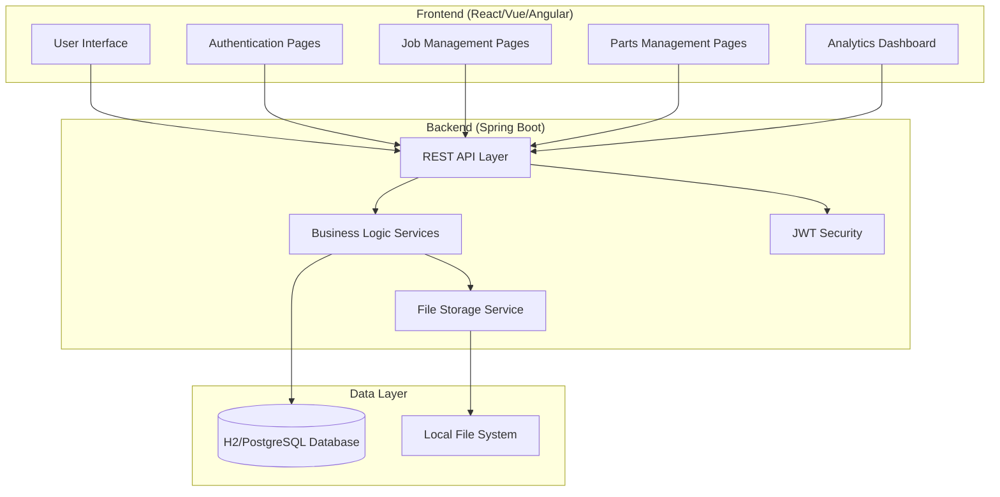
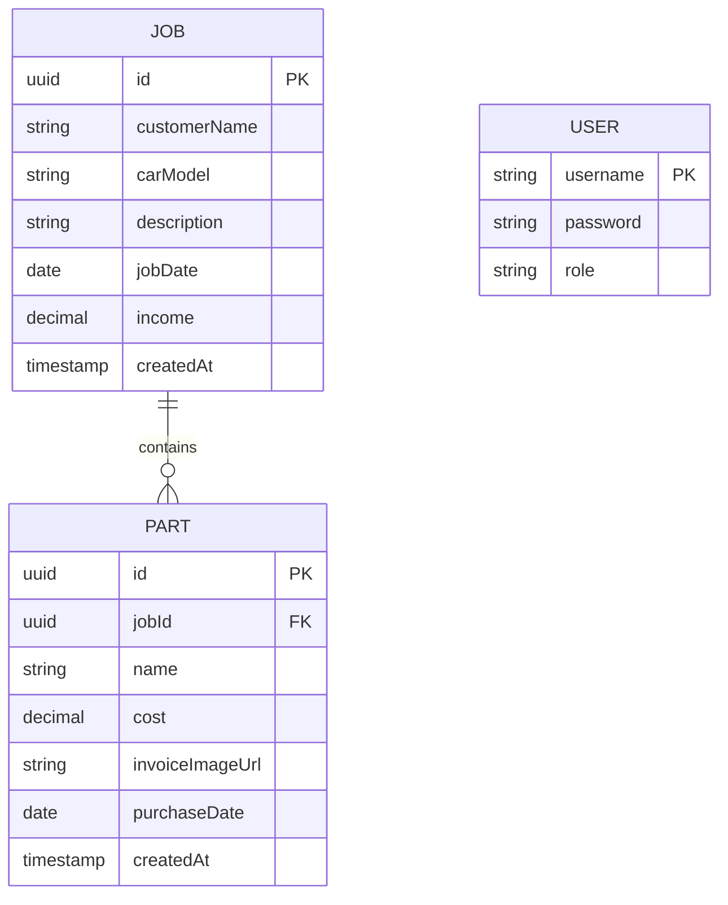
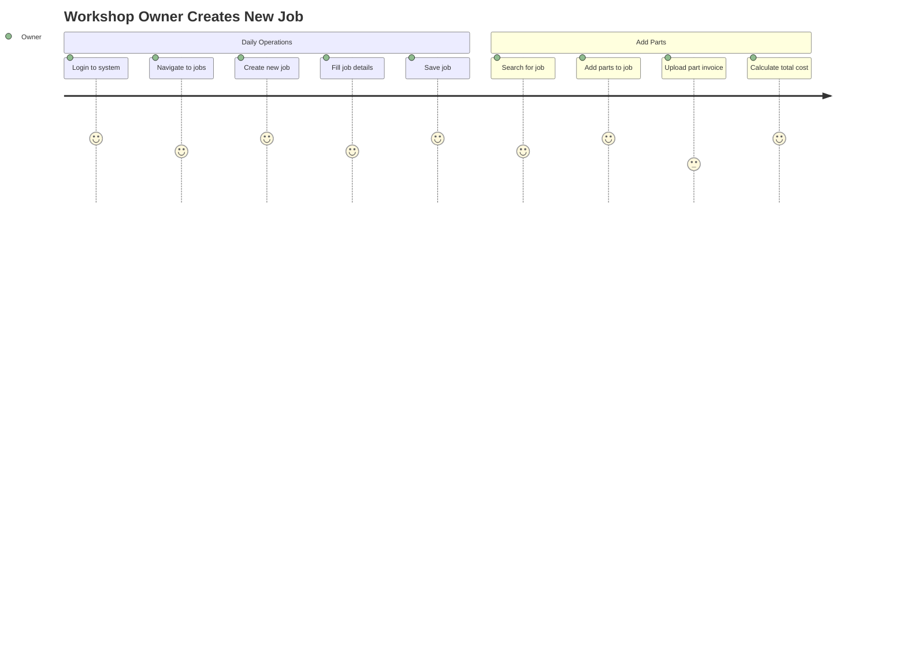
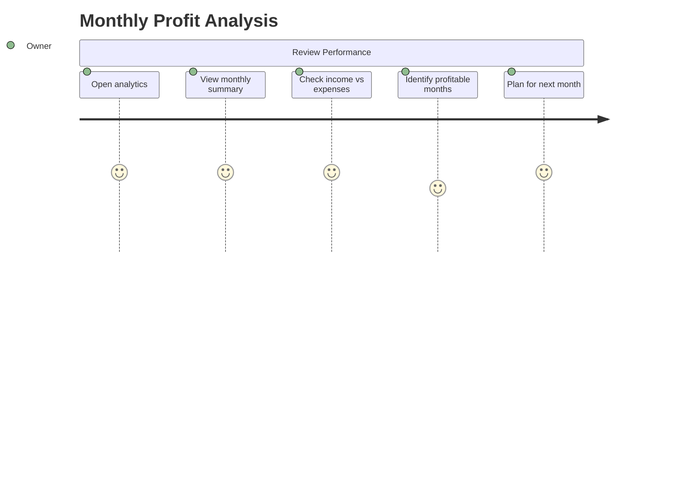
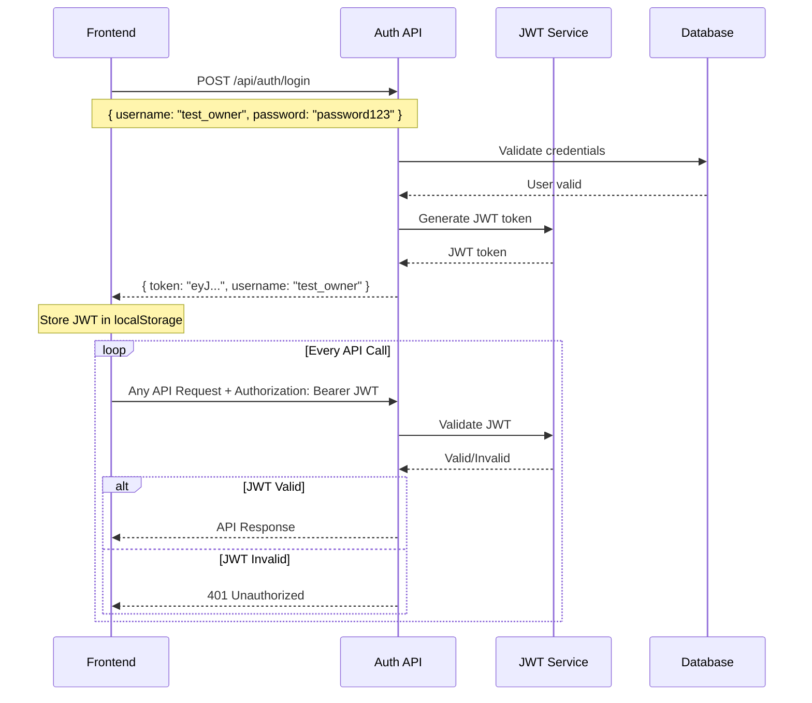
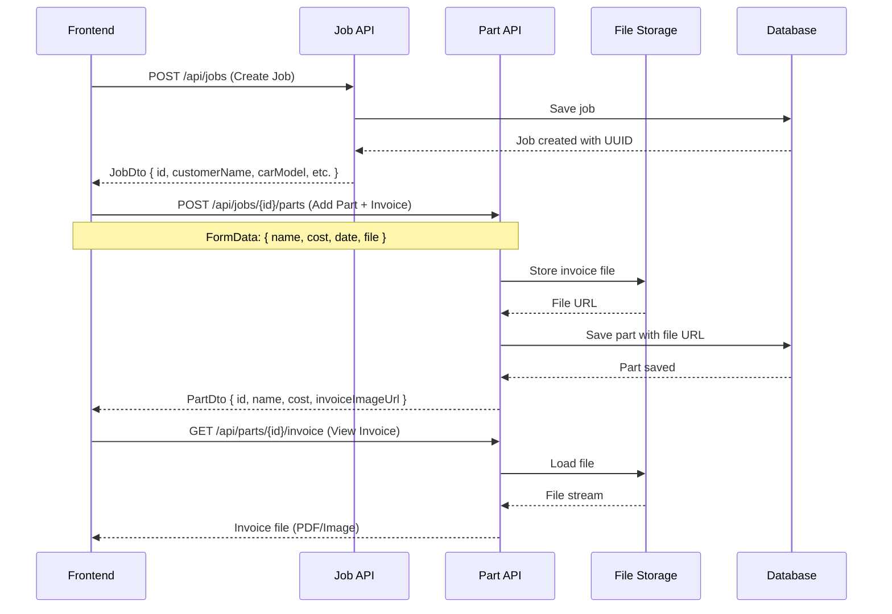
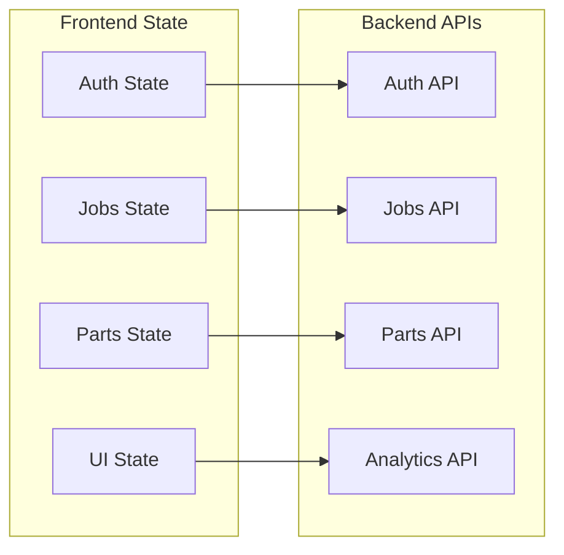

# MechTrack - Automotive Workshop Management System

## 🎯 Project Vision
MechTrack is a comprehensive web application designed to help automotive workshop owners manage their daily operations, track repair jobs, manage parts inventory, and analyze business performance.

## 🏗️ System Architecture Overview



## 🔑 Core Business Entities



## 🎭 User Personas & Use Cases

### Primary User: Workshop Owner (Mike)
- **Goal**: Manage daily workshop operations efficiently
- **Needs**: 
  - Track repair jobs and customers
  - Manage parts inventory and costs
  - Store invoice images for parts
  - Analyze monthly profits
  - Quick access on mobile/desktop

### Key User Journeys:

#### 1. **New Repair Job Workflow**


#### 2. **Monthly Business Analysis**


## 🔄 API Workflow Diagrams

### Authentication Flow


### Job Management Flow


## 🎨 Frontend Implementation Guide

### 1. **Application Structure**
```
src/
├── components/
│   ├── auth/
│   │   ├── LoginForm.jsx
│   │   └── ProtectedRoute.jsx
│   ├── jobs/
│   │   ├── JobList.jsx
│   │   ├── JobForm.jsx
│   │   ├── JobCard.jsx
│   │   └── JobSearch.jsx
│   ├── parts/
│   │   ├── PartList.jsx
│   │   ├── PartForm.jsx
│   │   ├── FileUpload.jsx
│   │   └── InvoiceViewer.jsx
│   ├── analytics/
│   │   ├── Dashboard.jsx
│   │   ├── MonthlyChart.jsx
│   │   └── SummaryCards.jsx
│   └── shared/
│       ├── Layout.jsx
│       ├── Navigation.jsx
│       └── Loading.jsx
├── services/
│   ├── authService.js
│   ├── jobService.js
│   ├── partService.js
│   └── analyticsService.js
├── hooks/
│   ├── useAuth.js
│   └── useApi.js
└── utils/
    ├── apiClient.js
    └── formatters.js
```

### 2. **Key API Integration Points**

#### Authentication Service Example
```javascript
// services/authService.js
class AuthService {
  async login(username, password) {
    const response = await apiClient.post('/api/auth/login', {
      username, password
    });
    
    localStorage.setItem('jwt_token', response.token);
    return response;
  }
  
  isAuthenticated() {
    return localStorage.getItem('jwt_token') !== null;
  }
  
  logout() {
    localStorage.removeItem('jwt_token');
  }
}
```

#### Parts Management with File Upload
```javascript
// services/partService.js
class PartService {
  async createPartWithInvoice(jobId, partData, file) {
    const formData = new FormData();
    formData.append('name', partData.name);
    formData.append('cost', partData.cost);
    formData.append('purchaseDate', partData.purchaseDate);
    
    if (file) {
      formData.append('file', file);
    }
    
    return apiClient.post(`/api/jobs/${jobId}/parts`, formData, {
      headers: { 'Content-Type': 'multipart/form-data' }
    });
  }
  
  getInvoiceUrl(partId) {
    return `/api/parts/${partId}/invoice`;
  }
}
```

### 3. **State Management Strategy**



## 🚀 Implementation Phases

### Phase 1: Core Authentication & Jobs (Week 1-2)
- [ ] Login/logout functionality
- [ ] Protected routes
- [ ] Job CRUD operations
- [ ] Job listing and search
- [ ] Basic responsive layout

### Phase 2: Parts Management & File Upload (Week 3-4)
- [ ] Parts CRUD operations
- [ ] File upload component
- [ ] Invoice viewing/downloading
- [ ] Parts-to-jobs relationship
- [ ] Form validation

### Phase 3: Analytics & Polish (Week 5-6)
- [ ] Analytics dashboard
- [ ] Monthly charts
- [ ] Summary statistics
- [ ] Error handling
- [ ] Loading states
- [ ] Mobile optimization

## 💡 Technical Considerations

### File Upload Handling
- **Max file size**: 10MB
- **Allowed types**: PDF, PNG, JPG, JPEG
- **Storage**: Local filesystem (easily migrated to cloud later)
- **Frontend**: Use `FormData` for multipart uploads
- **Preview**: Direct links to `/api/parts/{id}/invoice`

### Authentication
- **Type**: JWT Bearer tokens
- **Storage**: localStorage (consider httpOnly cookies for production)
- **Expiration**: 1 hour (configurable)
- **Refresh**: Manual re-login (can add refresh tokens later)

### API Response Format
All APIs return consistent JSON structure:
```json
// Success Response
{
  "id": "uuid",
  "field1": "value1",
  "field2": "value2"
}

// Error Response  
{
  "timestamp": "2025-09-13T14:22:13",
  "status": 400,
  "error": "Bad Request", 
  "message": "Validation failed"
}
```

## 🎯 Success Metrics
- [ ] Workshop owner can create and manage jobs in under 2 minutes
- [ ] File upload works reliably for invoices up to 10MB
- [ ] Analytics provide clear monthly profit insights
- [ ] Mobile-friendly interface for on-the-go access
- [ ] Zero data loss with proper error handling

---

**Ready to build?** This overview should give your frontend developer everything they need to understand the project scope, technical requirements, and implementation approach. The Postman collection provides all the API details, while this document explains the "why" and "how" from a user perspective.
